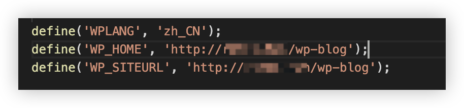

在上一集中，我们成功通过公网IP访问到了我们自己的博客页面，并且成功为博客设置了中文。但是接下来在本集中，将进一步带你接入域名

# 注册域名
1. 购买域名
首先在[阿里云万网](https://wanwang.aliyun.com/?spm=5176.29045373.J_rW7T_R7XtnzIwKiZ35vFI.d_logo.4cf41838UWoPHt)购买域名，选择一个自己想要的域名然后查询，点击购买之后进入该界面进行购买：
![!\[\[Pasted image 20241027214147.png\]\]](assets/image10.png)
需要注意购买的时候，得验证信息模板实名认证成功。购买完成之后，等待审核即可。
2. 域名备案
购买完成之后记得要备案，备案的网站：https://beian.aliyun.com/pcContainer/myorder
在里面点击开始备案即可。
3. 域名解析
![!\[\[Pasted image 20241109161132.png\]\]](assets/image11.png)
进入云解析控制台，点击解析设置
![!\[\[Pasted image 20241109161231.png\]\]](assets/image12.png)
然后点击新手引导，按照内容输入服务器的IP地址即可，输入完成之后域名解析DNS完成。
4. 修改数据库配置
登录你的ECS服务器，`mysql -u root -p` 命令进入数据库
`use wordpress;` 切换到Wordpress。为WordPress网站设置新域名。
Linux命令：
```sql
update wp_options set option_value = replace(option_value, 'http://实例公网IP', 'http://www.example.com') where option_name = 'home' OR option_name = 'siteurl';
UPDATE wp_posts SET guid = replace(guid, 'http://oldip','http://yourdomain.com');
UPDATE wp_posts SET post_content = replace(post_content, 'http://oldip', 'http://yourdomain.com');
UPDATE wp_postmeta SET meta_value = replace(meta_value,'http://oldip','http://yourdomain.com');
```
然后`exit;` 退出即可

进入wp-config.php，更改地址和站点地址为你的域名即可。
当然你也可以在这里更改：
![!\[\[Pasted image 20241109164507.png\]\]](assets/image14.png)
大家可以访问：[rende.fun](http://rende.fun/wp-blog/)来访问我的博客地址