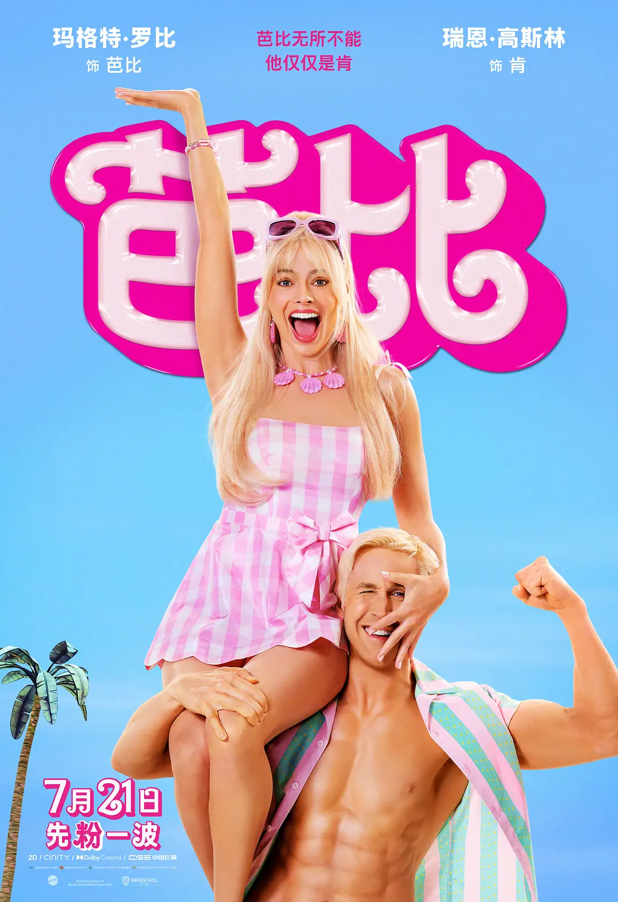
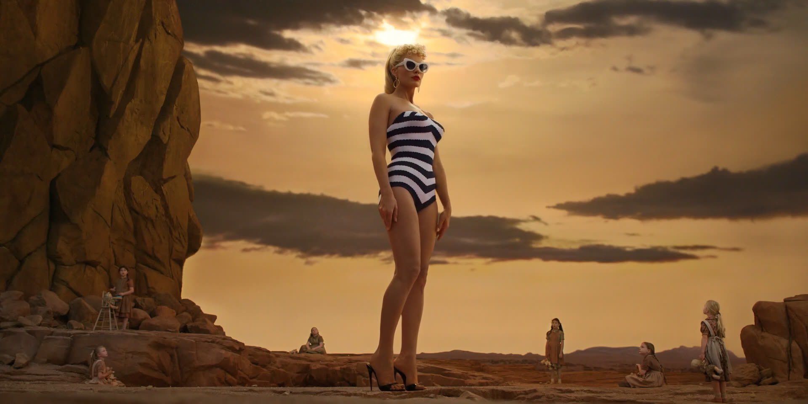

《芭比》一部2023-07-21上映的电影（与奥本海默同期上映），获得了96届奥斯卡最佳影片(提名)。
● 豆瓣评分：8.0⭐
● IMDB评分：6.8⭐
● 个人推荐指数：⭐⭐⭐⭐⭐（一定要看）
  ○ 这样一部有着极端的男权主义和极端的女权主义的电影，内容诙谐幽默且颇有讽刺意味，最终不忘探寻自我价值的追寻，算是男女思想永远无法平等的另一种出路——自我追求。

# 女性意识的崛起
从海报的主题就可以看到，影片以粉色作为主题，并且整部电影有着诙谐幽默的风格。
电影的一开始，致敬了库布里克的《2001太空漫游》这部经典的科幻电影。

随着《查拉图斯特拉如是说》音乐的响起，一个巨大的芭比出现在了荒原之上，就像在《2001太空漫游》中每一次同样是这段音乐响起的时候，都是巨大的黑石的出现，它象征着人类每一次的质的进化。
.png>)
巨大的芭比的出现同样象征了人类文明中女权意识的崛起。就像后面说到的，Barbie can be anything, women can be anything. 
在《2001太空漫游》中，巨石的第一次出现，赐予了猩猩们工具，他们手中拿着骨头可以作为工具作为武器，合理利用工具对于一个物种是质的进化。
.png>)
在《芭比》中，有意思的是，小女孩手中拿的是一个洋娃娃，将周围的一切杂碎，象征了芭比玩偶的重要性，就像是当年人类会使用工具一样，哈哈哈。
.png>)
在《2001太空漫游》中，猩猩将手中的骨头工具抛上了天空，《芭比》中小女孩将娃娃抛向了空中，紧接着，随着欢快的音乐，正片开始了!!
不得不说，借《2001太空漫游》之手，表达了芭比的意义和女性意识的崛起，巧妙的致敬也颇为诙谐，随着欢快的音乐开始，这一片头便奠定了整个影片的基调。

## 女权下的芭比乐园
影片中营造了一个神奇的、停留在无数人小时候梦想中的芭比乐园
.png>)
粉色的家具，粉色的服饰，粉色的城市，一眼望去所有皆为粉。
.png>)
因为这座城市是芭比乐园，几乎各行各业都是芭比，包括黑芭比总统（哈哈哈政治很正确）
.png>)
当然还有少数男性，其中就包括纯情、恋爱脑、一心直追求芭比却屡遭挫折的肯：
.png>)
不得不说，高斯林在穿上猛男粉之后，在片中的喜感也是拉满。
跟后面现实世界的对比可以看到，这是一个极度女权的乐园，芭比掌握着所有。男性都想法设法为了和芭比说上话、在一起，每一个夜晚皆是girl's night。
.png>)
当然影片一开始并没有去抨击或者讽刺这样一个充满着女权的芭比乐园，甚至观众在其中感受不到那份压抑，毕竟那份压抑是只有肯一个人的压抑，相比于整个乐园的欢乐气氛简直太渺小了。
而没有对比就没有伤害，影片巧妙的连接了芭比乐园和现实社会，一个充满着女权的乐园和一个充满着男权、父权的社会的对比。这个对比使得影片颇为讽刺。
# 男性意识的崛起
## 现实社会
当充满自信、一直很开心的芭比来到现实世界后，她变得不自在，感觉到压抑。
.png>)
人们因为芭比穿着暴露而对芭比开一些 下流的 玩笑，在这一声声的玩笑中，芭比变得不那么自信，她感叹着这里的一切怎么都是男人。
.png>)
而在芭比乐园中总是配角，总是为了衬托芭比，总是为了得到芭比芳心的肯变得自信起来，他觉得大家在欣赏自己。
这一巧妙的性格对转，同样也是世界的反转，也为现实父权社会埋了伏笔。
.png>)
有意思的是，肯一个人在大街上瞎溜达的时候
.png>)
我们分析片头的时候提到的《查拉图斯特拉如是说》音乐再一次响起了，这次象征着肯内心男权意识的崛起——他看到了穿着大衣的男性、 健身房里一个个有着肌肉的男性、健身房里充满着力量的画面、小皮卡汽车的出现、骑马警官的出现、一群男性在一起讨论时拒绝女性插嘴的画面、男性总统、印着男性的美元、打着高尔夫穿西装的男性等等一闪而过的画面，各行各业里都是男性的身影，这一段内心的崛起，把肯给乐坏了哈哈哈。
.png>)
前面芭比乐园的女性充斥在各行各业与此时的场景形成了强烈的对比，颇有讽刺意味，有对比就有落差，有落差就有了分歧，男权与女权本身就无法平衡，社会与人性皆是这样。
开心的肯直接回芭比乐园建立了一整套父权社会，颠覆了芭比的统治，更是释放了压抑许久的内心
.png>)
## 男权下的芭比乐园
当芭比再次回到“芭比乐园的时候”，这里一整个大反转了。这段戏很有戏剧性和冲突。
肯向其他男性讲述着男权与父权社会。灌输着男性应该是怎样的：世界上一切都应该是给男人增光添彩而存在的。
.png>)
就连见到芭比回来的时候，也不像以前那样，直接称呼tiny baby
.png>)
看到粉色的场景下，充满了男性元素——马、牛仔帽、大衣、拳击、肌肉。甚至还专门起了一个名字
.png>)
可以看到芭比乐园变向了另一个极端，男性主宰着一切，这是肯压抑多年内心的崛起与反噬。颇为讽刺的是，此时的乐园里，芭比变成了男性的附属品，穿着各式各样的服装的芭比为肯服务
.png>)
.png>)
肯给芭比乐园带来了父权思想，就像16世纪殖民者为大陆带来了天花病毒一样，没有人有抗体，几乎所有的芭比都沦陷了。颇为讽刺的比喻，讽刺了没有思想的跟风与效仿带来的离谱的现象。
就像之前每一晚都是girl's night，现在每一晚都是boy's night。高斯林甚至说完这句话又带了一个墨镜，墨镜套墨镜哈哈哈。
.png>)
## 男权与女权的冲突与和谐
最终芭比和肯达成了一致与和谐。
肯意识到了自己的错误，提到自己发现父权和马没有关系之后，自己就后悔了。这就是常常干扰的概念，父权制度与男性元素，女权制度与女性元素，这个世界所有的男性元素与女性元素都是属于各自性别的特点，若将其极端主义化，整个社会的思想也会变的极端。
.png>)
芭比也意识到了自己的错误，不该把肯当作理应存在的陪衬品，不该每一晚都是girl's night。
.png>)

# 个人自我的追寻
到上面的分析为止，整个电影的冲突与讽刺就结束了，拥有了一个happy ending，两种思想和谐的共处了，但还不够，让我觉得这部电影十分值得推荐的原因是，后面整部电影升华了，主题不仅仅局限于极端男女思想的讽刺与探讨。更是对自己是谁，本我的探讨，自我价值的追寻的抽象描述。
就像肯所说，他不知道自己是谁了，他一直以来是芭比身后的肯，there is no just ken，在这一场闹剧之后，他迷茫了。
影片借芭比之口，回答了这个答案：
“你不是你的女友， 不是你的房子，也不是大衣，也不是海滩，那些造就了你的东西并非真正的你。不是芭比之后的肯，而是肯。”
Ken is Me!悟了之后的肯乐坏了哈哈哈。
.png>)
芭比乐园的肯和艾伦们也追求者自己的梦想和职业。
芭比以前虽然是女性的代表，Barbie can be anything, women can be anything. 但是从来没有一位普通芭比，一位作为妈妈的芭比，一位想做着自己想做的事情的芭比，为自己而活的芭比，而不是为了创造出来填补女性职业空缺的芭比。这才是真正的Barbie can be anything。
就像每个人的当下一样，没有结局，包括芭比也没有结局，她自己的人生这才刚刚开始
.png>)

